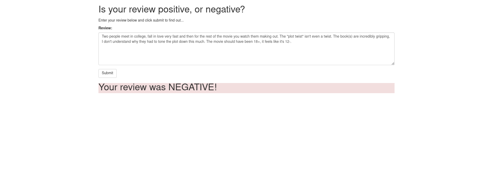

## Negative Example of the webpage

Curl request:

```sh
curl 'https://0zpe2p9s42.execute-api.us-east-2.amazonaws.com/prod' \
  -H 'User-Agent: Mozilla/5.0 (X11; Linux x86_64; rv:78.0) Gecko/20100101 Firefox/78.0' \
  -H 'Accept: application/json, text/javascript, */*; q=0.01' \
  -H 'Accept-Language: en-US,en;q=0.5' \
  --compressed -H 'Content-Type: application/json' \
  -H 'Origin: http://0.0.0.0:8000' \
  -H 'DNT: 1' \
  -H 'Connection: keep-alive' \
  -H 'Referer: http://0.0.0.0:8000/' \
  -H 'TE: Trailers' \
  --data-raw $'{"body":"Two people meet in college, fall in love very fast and then for the rest of the movie you watch them making out. The \\"plot twist\\" isn\'t even a twist. The book(s) are incredibly gripping, I don\'t understand why they had to tone the plot down this much. The movie should have been 18+, it feels like it\'s 12-."}'
```

Response:

headers
```sh
HTTP/2 200 OK
date: Sun, 12 Jul 2020 00:05:24 GMT
content-type: application/json
content-length: 113
x-amzn-requestid: 10e06b43-a19a-4d0c-ae5c-ac5e2719980b
access-control-allow-origin: *
x-amz-apigw-id: PiIGnFqOCYcFszQ=
x-amzn-trace-id: Root=1-5f0a53c3-485b71ec5aa3f0948c0e01e4;Sampled=0
X-Firefox-Spdy: h2
```

body
```javascript
{"statusCode": 200, "headers": {"Content-Type": "text/plain", "Access-Control-Allow-Origin": "*"}, "body": "0.0"}
```




## Positive Example of the webpage 

Request:

```sh
curl 'https://0zpe2p9s42.execute-api.us-east-2.amazonaws.com/prod' \
  -H 'User-Agent: Mozilla/5.0 (X11; Linux x86_64; rv:78.0) Gecko/20100101 Firefox/78.0' \
  -H 'Accept: application/json, text/javascript, */*; q=0.01' \
  -H 'Accept-Language: en-US,en;q=0.5' \
  --compressed \
  -H 'Content-Type: application/json' \
  -H 'Origin: http://0.0.0.0:8000' \
  -H 'DNT: 1' -H 'Connection: keep-alive' \
  -H 'Referer: http://0.0.0.0:8000/' \
  -H 'TE: Trailers' \
  --data-raw '{"body":"This was fantastic. A musical so amazingly done! The characters and singing are fantastic! Auto tune has taken over the music department but not with this! These are their real voices! 10/10!"}'
```

Response:


body

```json
{"statusCode": 200, "headers": {"Content-Type": "text/plain", "Access-Control-Allow-Origin": "*"}, "body": "1.0"}
```

headers

```sh
HTTP/2 200 OK
date: Sun, 12 Jul 2020 00:12:45 GMT
content-type: application/json
content-length: 113
x-amzn-requestid: 46eb4530-5288-419b-b542-5a45c782f48b
access-control-allow-origin: *
x-amz-apigw-id: PiJLlFPdiYcF1PQ=
x-amzn-trace-id: Root=1-5f0a557d-17b9d4ac9c9b4d1034a49314;Sampled=0
X-Firefox-Spdy: h2
```


